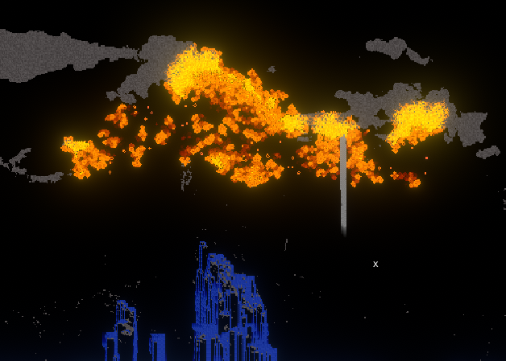
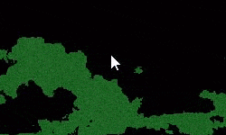

## Introduction

Here's an attempt at recreating the Sand Game on the GPU using compute shaders in Unity.

You can see it in action [here](https://preview.redd.it/vzwvhd3oehf51.gif?format=mp4&s=db4d21f6946280f9a162aa0b1a0a86245a7bd38c)

## Simulation

The simulation is done in a StructuredBuffer instead of a texture, so I can fit more data per pixel instead of a single color. I send the buffer to the shader on start using *ComputeShader.SetBuffer*. Then it's dispatched every frame in *Update()*. I also send a *RenderTexture* to store the result of the simulation.

So each frame the compute shader is dispatched, writes it's results to the RT that I assign to a plane material to see it in the scene.

The rules of the simulation are fairly simple, each pixel state for the next iteration of the simulation is determined by its neighbours.

<div class="image_container">
    
    
</div>

For the fire behaviour I used the same logic as Conway's game of life, and it spreads to neighbour pixels if they're trees. So if the current pixel is a *TREE*, and any neighbour is a *TREE* or a *TREE_BURNING*, it has a high chance to become a *TREE_BURNING* aswell in the next iteration of the simulation.

```c++
    if(state == TREE)
    {
        for(int i = 0; i < 8; i++)
        {
            if(nbs[i] == FIRE || nbs[i] == TREE_BURNING)
            { 
                if(rand < BURN_CHANCE)
                SetState(id.xy, TREE_BURNING);
            }
        }
    }
```

Last step in the compute is to set the pixels to the RenderTexture, I just do a switch between the block types and set a color accordingly.

***

[back](../blog.html)
