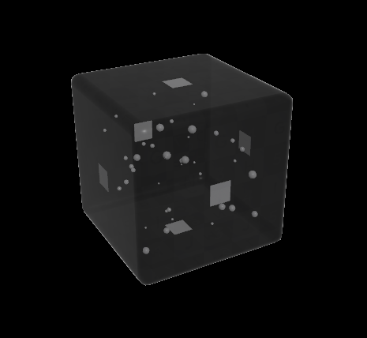

## Introduction

Here's a little breakdown of our *HoudiniGameJam2022* game [Dice Garden](https://borderline.itch.io/dice-garden) that I made with [Constantin Liétard](https://twitter.com/screenshakes).

## Table of contents

Environment

- [🌋 Islands](#Islands)

- [🌿 Grass](#Grass)

- [🌌 Portals](#Portals)

- [⬛ Obelisks](#Obelisks)

Visual Effects

- [⛅ Clouds](#Clouds)

- [🌼 Plants](#Plants)

- [📡 HUD](#HUD)

Dice

- [🎲 Dice](#Dice)

<a name="Islands"></a>

## Islands

The islands are generated using Heightfields, I start off by extruding a 2D shape and applying a bunch of noises on it to have the base shape. Geometry doesn't need to be clean, we just want interesting silhouettes here.


Then I convert that to a Heightfield using a *Heightfield Project* node.


I convert it back to polygons, polyreduce & clip it, so that I'm left with only what will end up as the bottom part of my island.
Then I use this mesh as a mask for another Heightfield that I use to build the upper part of the island.


Then I merge them together, fuse them and convert them to VDBs to have a more uniform & smooth shape overall. Back to polygons, I add ambient occlusion using a *Mask by Ambient Occlusion* node and voilà!


After generating the base island I also extract the top polygons (by grouping them by their normals) to be used by the grass system.


<a name="Grass"></a>

## Grass

The grass is made using the same fur technique as in the game Shadow of the Colossus.


Essentially instead of having each grass blade modeled, it's rendered inside a texture as multiple slices of polygons patches on the base model. Each slice clips it's alpha from a noise texture, getting thinner and thinner as the slices go up. 


From the top slice I extracted earlier we instantiate a bunch of copies with a slight offset from the base using *Graphics.DrawMeshInstanced*.


Seems like a lot of polygons but it's still way less that if we had polys for each grass blade at this density. The technique has some drawbacks though and tend to break as the view point gets closer to the ground.

<a name="Portals"></a>

## Portals

Portals are made using a Labs tree generator. I added a few attributes to the leaves to add a bit of movement in the shader in Unity. It took a few tweaks to have it working on a circle, but the generator is pretty fun to use and works quite well.

<div class="image_container">
    
    
    
</div>

<a name="Obelisks"></a>

## Obelisks

I use a similar setup to generate the tree on top of the obelisks, starting with a spiral that I raycast against the model. To orient each point to look towards the obelisk :

```c#
    @N = -normalize(@P);
    @N.y = 0;
```

<div class="image_container">
    
    
    
    
</div>

<a name="Clouds"></a>

## Clouds

Clouds were made using the *Cloud* node. I start with a primitive sphere, copy a bunch of randomly sized spheres to it, then convert it to a cloud and use the *Cloud Noise* SOP to give it a more interesting shape.


Before exporting I also smooth the normals so that it looks softer in Unity. This is simply done with the *Smooth* node on the *N* attribute.

<div class="image_container">
    
    
</div>

<a name="Plants"></a>

## Plants

Plants are generated from scattered points on a circle. I copy twisted lines with a special *pscale* attribute.
The further they are from the center, the smaller they get.

```c#
    f@pscale = (1 - clamp(length(@P) * chf("Scale"), 0, 1)) * chf("Global");
```

Then I read that value in *Switch* nodes to see if I should spawn a flower on top or not, and if the stem should be a tube or a regular grass strand shape, thinner at the end.


To make them grow I use a Pyro simulation, then bake its temperature information in the vertex colors to be used by the shader in Unity.
I found the *Pyro Source Spread* node to be one of the easiest setup for spreading/growing attributes.

I divide the *totalburn* of each point by the maximum of the simulation to have values between 0 and 1.

<div class="image_container">
    
    
    
</div>

I use this value in the shader to clip the pixels if it's below some threshold, and a smoothstep of the same value in the emission to get the white edge.

<a name="HUD"></a>

## HUD

The HUD uses an additional camera with a replacement shader ( we're using Legacy ). Every object within specific layers get drawn an extra time using a screenspace shader, blended on top of the existing render.


<a name="Dice"></a>

## Dice

Nothing too fancy here, they're all basic primitives unwrapped using *UVUnwrap* that did a decent job without any tweaking.


I also generate some bubbles inside using a *Points from Volume* with some jitter, and also a little quad per face to replace it later on in Unity with the dice symbols.

<div class="image_container">
    
    
</div>

## Project Files

You can download the project file [**here**](../sources/dicegarden.hiplc)

***

[back](../blog.html)
