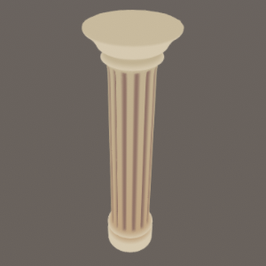

# Nodevember 2020 with Amplify Shader Editor

***

Here's my 2020 nodevember adventure to practice a little more Amplify. These were all made in 1-2 hours, starting from a highly subdivided sphere. I added the shader files but keep in mind the graphs were not cleaned at all.

    

        
    

01 - Cookie
<a href=".">Download</a>

    

        
    

02 - Candy
<a href=".">Download</a>

    

        
    

03 - Fruit

    

        
    

04 - Grain

    

        
    

05 - Pastry

    

        
    

06 - Drawing

    

        
    

07 - Print

    

        
    

08 - Layered

    

        
    

09 - Fluffy

    

        
    

12 - Ancient

If you have any question you can message me directly [@tomdns_](https://twitter.com/tomdns_)

***

[back](../)
