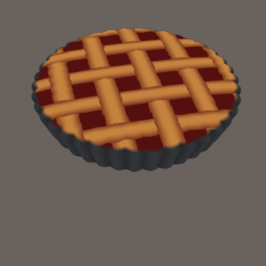

# Nodevember 2020 with Amplify Shader Editor

***

Here's my 2020 nodevember adventure to practice a little more Amplify. These were all made in 1-2 hours, starting from a highly subdivided sphere and without any texture inputs. I added the shader files but keep in mind the graphs were not cleaned at all. [**Download them all here**](../sources/nodevember2020.unitypackage)

    

        
    

    
Cookie

    

        
    

    
Candy

    

        
    

    
Fruit

    

        
    

    
Grain

    

        
    

    
Pastry

    

        
    

    
Drawing

    

        
    

    
Print

    

        
    

    
Layered

    

        
    

    
Fluffy

    

        
    

    
Ancient

You can check the timelapses for each day on my twitter [**here**](https://twitter.com/tomdns_/status/1323107803838488576)

***

[back](/blog.html)
