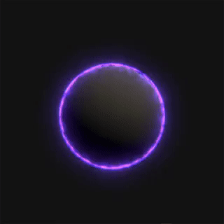
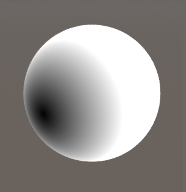
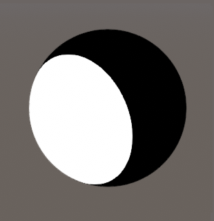
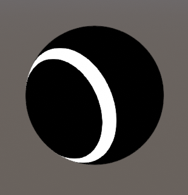
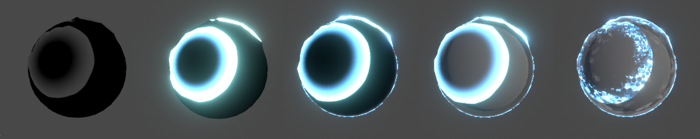

## Introduction

Here's a small breakdown of a shader I showed on [twitter](https://twitter.com/tomdns_/status/1177389679815135233). The goal was to have multiple points of impact in the shader itself, and to be able to work on any mesh that already had UVs.
Note that it was made in Unity but the shader logic can apply anywhere, only the hit detection part will be different.

<div class="image_container">
    
    
</div>

## Hit Detection

First in a regular script I Raycast from the mouse to the sphere collider. If it hits, I take the hit position and the time of impact *Time.timeSinceLevelLoad* and store that in a Vector4 array, with the position in the xyz component and the time in the w component. 

```c#

hits[index] = new Vector4(hit.x, hit.y, hit.z, t);

```

Then I send it to the shader

```c#

shieldMaterial.SendVectorArray("_Hits", hits);

```

Note that the array on the C# side and in the shader need to be initialized with the same size.

## Rings

To make multiple rings in the shader, I loop through each hit in *_Hits* and do as follows:

+ Take the distance between the hit position and the vertex position



+ Step the distance, by a value *t* between 0 and 1



+ Step the distance again using *t - ringWidth*, and substract both stepped values



+ Take the *max()* of the resulting value and the previous one in the loop to add them all together.

You can replace later on step with smoothstep to have a smoother ring.

> The *t* value is used to drive the step/smoothstep of both distances, meaning as *t* gets bigger the ring will visually travel further.

Now we need to find a way to use the time of impact stored in the w component of each hit, so that they can all expand independently.
We can use Unity current time that's available in every shader *_Time.y*, substract it by the time of impact and clamp the result between 0 and 1.

```c#
    float t = saturate(_Time.y - _Hits[i].w);
```

Meaning that at the time of impact *_Time.y = _Hits[i].w* so it outputs 0, and as the time gets bigger but our w component stays the same, the *t* value gradually goes from 0 to 1. I used the *saturate* function which does the same thing as a clamp01.

I also multiply each ring by its *t* value, so that as it travels it also fades to black.

Here's what the loop looks like so far

```c#
    float mask = 0;
    for(uint i = 0; i < HIT_COUNT; i++)
    {
        float t = saturate(_Time.y - _Hits[i].w);

        float d0 = distance(vertex, _Hits[i].xyz);
        float d1 = step(t, d0);
        float d2 = step(t - _RingWidth, d0);
        
        mask = max(mask, d1 - d2);
    }
```

Then I use this mask as alpha, multiplying it by a tiling hexagonal texture and a bunch of panning noises. Went a bit overkill with a GrabPass distortion as well. Here's a small decomposition of the effect

 

***

[back](../blog.html)
