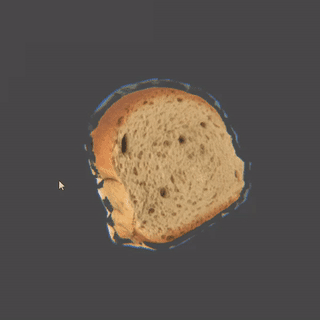

# Shader Breakdown - Shield Impacts

***

<div class="image_container">
    
    
</div>

Quick breakdown of the shader I showed on [twitter](https://twitter.com/tomdns_/status/1177389679815135233).

Here whenever I detect a collision with the sphere I add the position to a Vector4 list, containing the time when it hit aswell in the w component.

```c#

hits.Add(new Vector4(hit.x, hit.y, hit.z, t));

```

Then I send the list to the shader, and for each hit to make rings I do as follows:

First take the distance between the hit position and the vertex position


Step the distance, using our time of impact *t* value


Step the distance again, using *t - ringWidth*, substract both stepped values, and *saturate()*


Then I take the *max()* of the resulting value and the previous one in the loop to add them all together.

In my case I use *smoothstep* instead of *step* to have a smoother transition of values instead of either 0 or 1, but step is easier to explain.

The *t* value is used to drive the step/smoothstep of the distances, meaning a bigger *t* will make the ring travel further.
We only need the time of impact so we can do *1 - saturate((_Time.y - t) / length)*, meaning that at the time of impact *t = _Time.y* (ring is stepped at 0), and as _Time.y goes up *t* will naturally go up to 1 maximum, capped by the saturate function that clamps the value between 0 and 1. Each ring also gets multiplied by its *t* value, so that as it travels it also fades to black.

This gives you a mask that you can use however you want.

Here's a decomposition of the effect:


If you have any question you can message me directly [@tomdns_](https://twitter.com/tomdns_)

***

[back](../)
