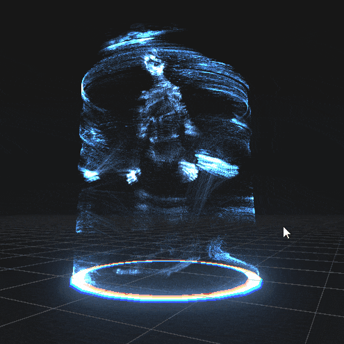

# Shader Project - Hologram (RTVFX Sketch #18 entry)

## Summary

The particles were made with a custom GPU particles system, using compute shaders to update them and geometry shaders for rendering.

It renders the particles buffer using *Graphics.DrawProcedural* (with *MeshTopology.Points*) and in the point material itself I recreate the geometry using GS. In this case for each point in the GS I create small line strips (using LineStreams), typically one for the particle itself, and then some so it connects to the cylinder around, to the projectors building the hologram etc.

I made it work for SkinnedMeshRenderers aswell, by baking the mesh each frame and sending the vertices to the compute shader (with *SkinnedMeshRenderer.BakeMesh()*)

You can see the work in progress on the RTVFX thread [here](https://realtimevfx.com/t/thomas-denis-sketch-18-hologram/6507).

And the final result:

If you have any question you can message me directly [@tomdns_](https://twitter.com/tomdns_)

* * *

[back](../)
