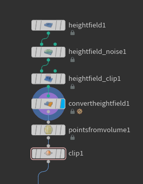
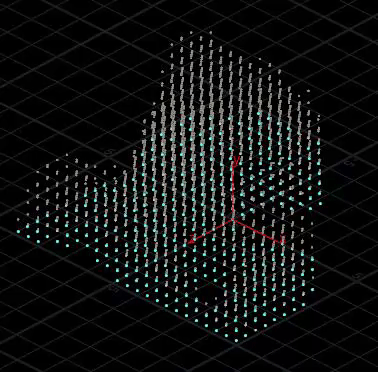
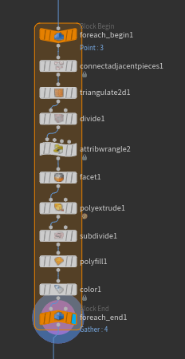

## Introduction

This is a small breakdown of the island generation in [Seaway](https://borderline.itch.io/seaway) for the 44th Ludum Dare.
I wanted to have a simpler version of the islands seen in Godus.

## Heightfield

The island height generation is quite basic. I only used the *HeightField Noise* SOP and played with the parameters till I was happy with the results. Just make sure to set *Combine Method* to *Maximum* so that we only get values above 0.

Here's what I came up with:


To get points from all of this we first need to convert the heightfield to polygons, using *HeightField Convert*. Then we can use a *Points from Volume*, and set the *Point Separation* to 2. This value will describe later on the height of each slice. Clip the points below 1 or more to remove every points from the ground and only keep separated bits of the heightfield.



Clipping the ground usually messes up our object position, we can reset it easily with some vex.
Append a *Point Wrangle* node and add the following code:

```c#
@P -= getbbox_center(0);
@P.y += getbbox_size(0).y * .5;
```

At the same time we can also add a point attribute from the points height, so we can use it later in our loop to gather all the points by slice.

```c#
i@height = rint(@P.y);
```

## Reconstructing the slices

Now that each point has an attribute called *height* representing its layer, we can easily loop through them. Plug in a *For-Each Named Primitive* and set *Piece Elements* to *Points*, and *Piece Attribute* to our point attribute name *height*. You should be able to see each layer individually by ticking Single Pass.



We can now work on each layer independently. Here's how I reconstructed the slices:



First, the *Connect Adjacent Pieces* node set to *Adjacent Points* goes through all the points and creates connexions with all their neighbours within a certain radius. Here I set the search radius to something like 4, it depends of what shape you want to have.

Then the *Triangulate 2D* node creates a mesh from the generated connexions. You can set the *2D Positions* to *Select Projection Plane* and leave the default settings. It makes sure every layer is remeshed in the same direction. This resets our layer's position though so we need to put it back to its original height. Simply get the current point *height* attribute and assign it to the current point Y position.

```c#
@P.y = i@height;
```

The *Divide* SOP is used to clean up the geometry. Untick *Convex Polygons* and tick *Remove Shared Edges* so that we're left with only one primitive from the previous triangulated mess. Follow that with a *Facet* to remove the inline points.

Then you can simply add a *PolyExtrude* and only output the sides, subdivide it, and put the caps back with a *PolyFill* node.

Finally you can add a color node set to *Ramp from Attribute* or *Random from Attribute* and use the *height* to drive it.

That's it!


## Further Improvements

This small tutorial only covered the generation of the base mesh. The heightfield SOPs can generate a lot of interesting data you could use to color the terrain or even as spawning conditions for props like trees and houses.

Also there's probably a better way to smooth the slices than using the Subdivide SOP, I tried several methods but none of them worked really the way I wanted to, so feel free to send me what you come up with!

There's also the HeightField Terrace SOP to look into, but it might be harder to have a simple / lowpoly design.

## Project Files

You can download the project file [**here**](../sources/sliced_mountain.hiplc)

***

[back](../blog.html)
