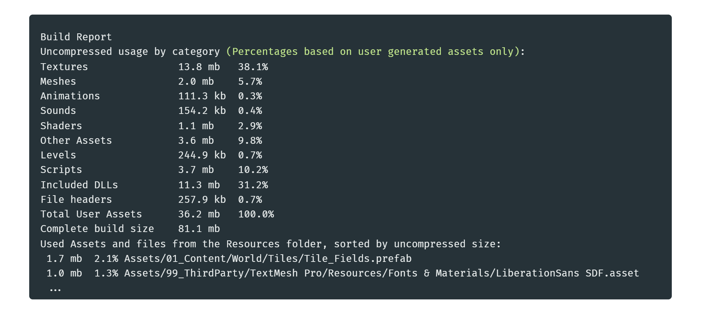

Quick tip on build sizes in Unity, and how to identify what's taking place in your project...

Everytime you build your project, you can see in the Editor.log if you scroll down to the end the ***Build report*** containing the assets usage per category and a list of every asset used in the build sorted by size.

You can find the file here in the console tab:

This is also great to spot assets that may not be used anymore but still somehow end up in the build. 

If you want to know where the asset is actually used you can grab its GUID in its .meta file, and considering you're using Git, you can do a ***git grep guid*** and it'll give you the list of references to the asset.

If you have any question you can message me directly [@tomdns_](https://twitter.com/tomdns_)

* * *

[back](../blog.html)
