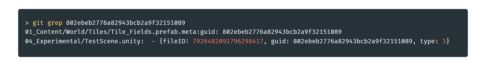

## Introduction

Quick tips on build sizes in Unity, and how to identify what's taking place in your project.

## Build Report

Everytime you build , you can see in the Editor.log if you scroll down to the end the *Build report* containing the assets usage per category and a list of every asset used in the build sorted by size.

You can find the file here in the console tab:

This is a great way to spot assets that may not be used anymore but still somehow end up in the build ( like if it's still present in a scene ). 
If you want to know where the asset is actually used you can grab its GUID in its .meta file and with Git, you can do *git grep [guid]* and it'll give you the list of where the asset is referenced.

***

[back](../blog.html)
