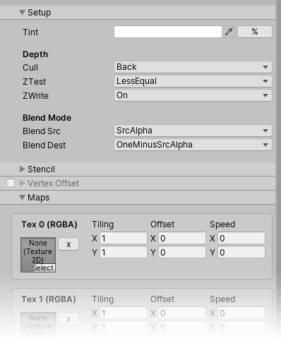
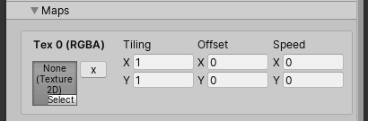

## Introduction

Here's a Uber shader I made specifically for VFX. It takes care of the boilerplate around panning textures, color adjustments, vertex streams, etc. in a simple and clear interface made using the [ShaderGUI](https://docs.unity3d.com/ScriptReference/ShaderGUI.html) api. Every checked "feature" generates shader variants so that only the wanted features are executed in the shader.

<div class="image_container">
    
    
    
</div>

## How the inspector works

For each material property I look up their shader property names to group them in special ways. For instance if I declare a texture in the shader and a speed property aswell that matches the texture name, it will automatically group them together in a nice block.

```c#
    _Tex0 ("Texture 0", 2D) = "white" {}
    _Tex0Speed ("Texture 0 Speed", Vector) = (0, 0, 0, 0)
```



The toggled foldouts are a bit hacky, I'm actually using a property in the shader that stores the state of the foldout toggle (activated/deactivated) and the state of the foldout itself (opened/closed). The property line with the toggle is drawn using a MaterialPropertyDrawer, and other properties that start with the name will get drawn below it, only when it's opened.

Here's an example in the shader

```c#
    [FoldoutToggle(_FEATURE_HITFLASH)] _ToggleHit ("Hit Flash", Vector) = (0,0,0,0)
    [HDR] _HitColor ("Hit Color", Color) = (1,1,1,1)
    _HitLength ("Hit Length", Float) = 1
```

Here *_ToggleHit.x* contains the toggle state, and *_ToggleHit.y* the tab state.

The MaterialPropertyDrawer of the toggle also handles setting the shader keywords, *_FEATURE_HITFLASH* in this case.

## 2021 Update

It now works a bit differently -- when I open the material inspector in *OnEnable()* I build up a list of every material property that exist, and their categories from the shader properties names, containing their foldout / toggle states. 

They all get saved in *SessionState*, which is kind of like *EditorPrefs/PlayerPrefs*, except that it only lives during the Unity session. Meaning that when I restart Unity the foldout states are not preserved. This is fine, I don't need it to remember which foldouts were open after quitting the engine, but for the toggle states ( which add / remove shader keywords ) I simply look up the existing shader keywords and set the toggles values based on that, also in the *OnEnable()* function. 

So all that means no more special ShaderLab properties needed, everything is handled on the ShaderGUI side.

I also took some time to make it prettier ✨


***

[back](../blog.html)
