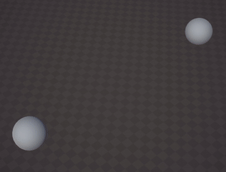

# Shader Project - Uber Shader VFX

***

Recently I made a Uber shader specially for VFX, I made a few tests to try it out.

<div class="image_container">
    
    
</div>

<div class="card">
    <div>
        
    </div>

<div class="card_child">
It was also a good occasion to make a custom Material inspector, using the ShaderGUI api and MaterialPropertyDrawers. 

Here when serializing the properties I look up the shader's properties names directly so I can have special behaviours like grouping the texture and its tiling/offset/speed if the properties names match. 

The toggled foldouts are a bit hacky, I'm actually using a property in the shader that stores the state of the foldout toggle (activated/deactivated) and the state of the foldout itself (opened/closed). The property line itself (with the toggle) is drawn using a MaterialPropertyDrawer, and other properties that start with the name will get drawn below it, only when it's opened.
</div>
</div>

Here's an example in the shader

```c#
    [FoldoutToggle(_FEATURE_HITFLASH)] _ToggleHit ("Hit Flash", Vector) = (0,0,0,0)
    [HDR] _HitColor ("Hit Color", Color) = (1,1,1,1)
    _HitLength ("Hit Length", Float) = 1
```

Here _ToggleHit.x contains the toggle state, and _ToggleHit.y the tab state.

The MaterialPropertyDrawer of the toggle also handles setting the shader keywords, _FEATURE_HITFLASH in this case.

If you have any question you can message me directly [@tomdns_](https://twitter.com/tomdns_)

* * *

[back](../)
