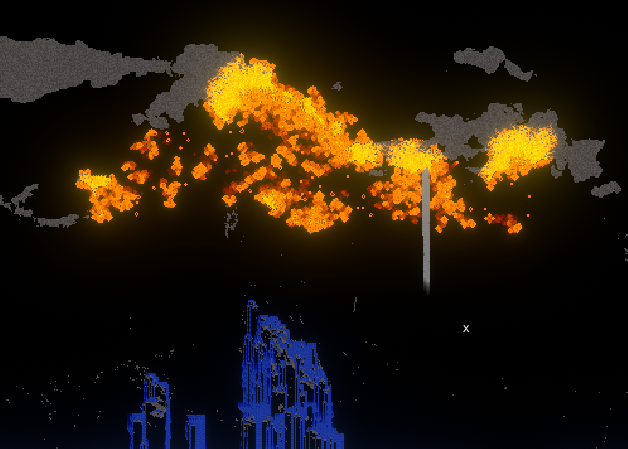

# Devnotes - Sand Game With Compute Shaders

* * *

Small experiments notes on making a sand game running in a Compute Shader...

I send a render texture to the compute that will contain the results of the simulation, I never read from it.
I send a RWStructuredBuffer the size of my texture (width * height), so for each pixel I have a struct that contains whatever data I need to send. For example storing the previous/current state ( or block type ), a color, a lifetime, ... 

```c#
    public struct Pixel
    {
        public int oldState;
        public int state;
        public Vector4 color;
        public float health;
        public float startHealth;
    };

    ...

    Pixel[] pixels = new Pixel[width * height];

    ComputeBuffer pixelsBuffer = new ComputeBuffer(width * height, sizeof(int) * 2 + sizeof(float) * 6);
    pixelsBuffer.SetData(pixels);
```

The struct has to be matched in the compute exactly the same.

Each frame I send the texture to the material, to the compute, and I dispatch the compute.
I kept the thread counts to [8,8,1] so I dispatch it this way

```c#
    compute.Dispatch(updateKernel, width/8, height/8, 1);
```

The rules of the simulation are fairly simple, for each block type you describe what to do according to the direct neighbours to the current pixel. The tricky part is for example with sand you want to have a condition for the sand block to become air when falling and vice versa, since you can't modify neighbour pixels directly, you need to have both conditions. 
I haven't really found a better way and it can make more complicated block types a pain to make but still, using basic rules you can have some really cool effects.



Here for the fire behaviour I used Conway's game of life, and it spreads to neighbour pixels if they're trees. This means in my TREE behaviour if any neighbour is a FIRE or a TREE_BURNING, it has a chance to become a TREE_BURNING aswell next iteration.

```c++
    if(state == TREE)
    {
        for(int i = 0; i < 8; i++)
        {
            if(nbs[i] == FIRE || nbs[i] == TREE_BURNING)
            { 
                if(rand < BURN_CHANCE)
                SetState(id.xy, TREE_BURNING);
            }
        }
    }
```

At the end of the simulation the compute also sets the texture color according to the buffer pixels type, since I'm only modifying the RWStructuredBuffer here, not the texture directly.

* * *

[back](../)
