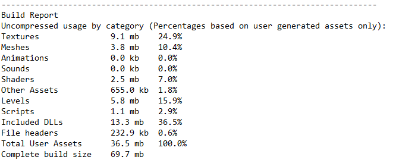
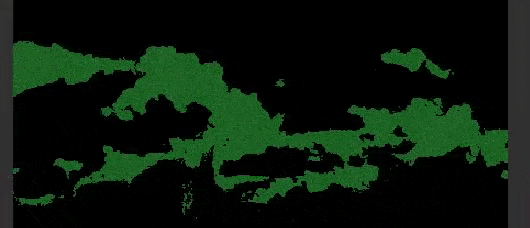

## Thomas Denis - Technical Artist

***

## 2020

    

         
    

    

        

        <a href="articles/tips-build-size.html">Unity Tips - Build Size And Assets Usage</a> 
        Quick tip on how to spot what's taking up place in your project
        

        

        September 2020
        

    

    

         
    

    

        

        <a href="articles/compute-game-of-life.html">Shader Project - A Sand Game With Compute Shaders</a> 
        A version of the classic game running on the GPU
        

        

        August 2020
        

    

    

         
    

    

        

        <a href="articles/simple-outline-post-process.html">Shader Tutorial - Simple Outline Post-Process</a> 
        A specific pixel-perfect outline for Desktop Garden, our #LD46 jam entry
        

        

        April 2020
        
  
    
  

    

         
    

    

        

        <a href="articles/uber-shader-vfx.html">Shader Project - Uber Shader VFX</a> 
        Custom shader & inspector to toggle shader features easily
        

        

        March 2020
        

    

## 2019

    

         
    

    

        

        <a href="articles/voxel-animation-texture.html">Shader Project - Voxel Animation Textures</a> 
        VATs for voxel simulations, from Houdini to Unity using Alembic
        

        

        December 2019
        

    

    

         
    

    

        

        <a href="">Houdini Project - Townscaper's grid</a>     
        Quick attempt in Houdini to generate the grid from Townscaper by Oskar Stålberg
        

        

        November 2019
        

    

    

         
    

    

        

        <a href="articles/shield-impacts.html">Shader Project - Shield Impacts</a>     
        An use case of sending an array of values to the shader
        

        

        September 2019
        

    

    

         
    

    

        

        <a href="articles/sliced-mountains.html">Houdini Tutorial - Sliced Mountains</a> 
        Learn how to generate Godus-inspired islands using heightfields in Houdini
        

        

        May 2019
        

    

## 2018

    

         
    

    

        

        <a href="articles/sketch-hologram.html">Shader Project - Hologram (RTVFX Sketch #18)</a> 
        Project made for the 18th sketch edition on realtimevfx.com. GPU Particles, Compute & Geometry shaders 
        

        

        November 2018
        

    

    

         
    

    

        

        <a href="javascript:void(0)">Shader Project - Parallax Sphere</a> 
        Parallax mapping without raymarching
        

        

        September 2018
        

    

