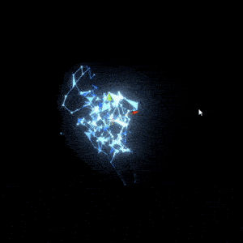
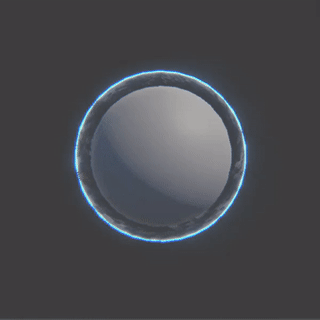
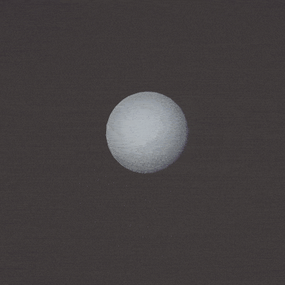
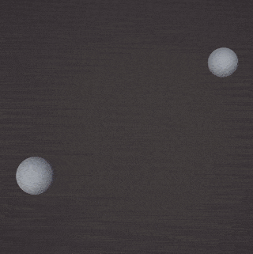
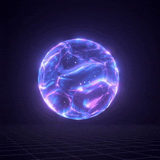
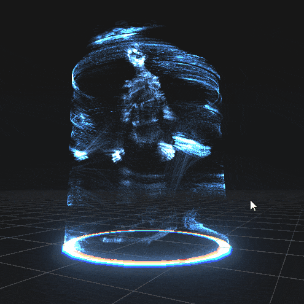

    

        
    

    

        
    

<!-- 

    

        
    

 -->

    

        
    

    

        
    

    

        
    

    

        
    

    

        
    

    

        
    

