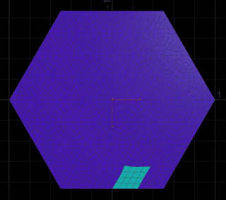

    

         
    

    

        <a href="articles/compute-game-of-life.html">Shader Project #3 - A Sand Game Running In A Compute Shader</a> 
        A version of the classic game running on the GPU
    

***

    

         
    

    

        <a href="articles/simple-outline-post-process.html">Shader Tutorial #1 - Simple Outline Post-Process</a> 
        A specific pixel-perfect outline for Desktop Garden, our #LD46 jam entry
    

***

    

         
    

    

        <a href="">Houdini Project #1 - Townscaper's grid</a>     
        Quick attempt in Houdini to generate a grid like the one in Townscaper by Oskar Stålberg
    

***

    

         
    

    

        <a href="articles/sliced-mountains.html">Houdini Tutorial #1 - Sliced Mountains</a> 
        Learn how to generate Godus-inspired islands using heightfields in Houdini
    

***

    

         
    

    

        <a href="articles/uber-shader-vfx.html">Shader Project #3 - Uber Shader VFX</a> 
        Custom shader & inspector to toggle shader features easily
    

***

    

         
    

    

        <a href="articles/voxel-animation-texture.html">Shader Project #2 - Voxel Animation Textures</a> 
        VATs for voxel simulations, from Houdini to Unity using Alembic
    

***

    

         
    

    

        <a href="articles/sketch-hologram.html">Shader Project #1 - Hologram (RTVFX Sketch #18)</a> 
        Project made for the 18th sketch edition on realtimevfx.com. GPU Particles, Compute & Geometry shaders 
    

