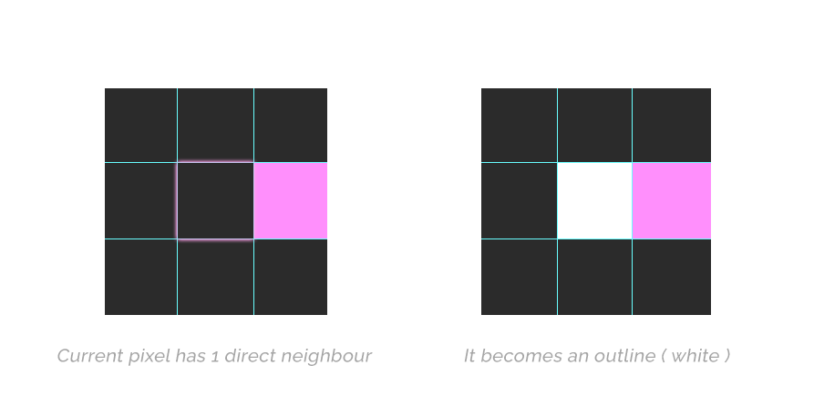

# Shader Breakdown - Simple Outline Post-Process

> Specific pixel-perfect outline for Desktop Garden, our #LD46 jam entry

* * *

## Intro

New Ludum Dare, new breakdown! We decided to make a weird game that's playable on your own desktop. See it in action [here](https://borderline.itch.io/desktop-garden). We wanted an easy way to add contrast to the whole image and keep a good visibility no matter what the background is. We went for a post-process outline, let's see how it was made!

## 1 - Post Process

First thing is to setup the post process logic itself. The idea is to **blit** into the main render texture using a special shader. This can be done via a small script added on the camera.

```c#
public class PostProcess : MonoBehaviour
{
    [SerializeField] Material material;

    void OnRenderImage(RenderTexture from, RenderTexture to)
    {
        Graphics.Blit(from, to, material);
    }
}
```

Now everytime we render a frame, the _MainTex property of *material* will be updated with the content of the RenderTexture. Meaning that we can now manipulate the texture however we want in the shader.
A simple shader that fetches the main texture would look like this:

```c++
Shader "PostProcess/Outline"
{
    SubShader
    {
        Tags { "RenderType"="Opaque" }

        Pass
        {
            CGPROGRAM
            #pragma vertex vert
            #pragma fragment frag

            #include "UnityCG.cginc"

            struct appdata
            {
                float4 vertex : POSITION;
                float2 uv : TEXCOORD0;
            };

            struct v2f
            {
                float2 uv : TEXCOORD0;
                float4 vertex : SV_POSITION;
            };

            sampler2D _MainTex;

            v2f vert (appdata v)
            {
                v2f o;
                o.vertex = UnityObjectToClipPos(v.vertex);
                o.uv = v.uv;
                return o;
            }

            float4 frag (v2f i) : SV_Target
            {
                return tex2D(_MainTex, i.uv);
            }
            ENDCG
        }
    }
}
```

## 2 - Outline Shader

The outline shader works this way:
For each pixel on the screen, we look at the direct neighbours of this pixel (top bottom left right), and compare their colors against another one (the background color in our case). 
Then from the number of neighbours that match the reference color we know if that pixel is part of the outline or not.

So for instance if my background is black, my current pixel is black, and every other pixel around the current one is black aswell, except one, it means that we're right next to a surface and that this pixel should become the color of the outline.



It worked great in our game because the color of the background is always the same (it's the key color we use to determine if the image should be transparent, like a greenscreen).

Let's see what it looks like in code!

First we have to sample all the neighbours

```c++
fixed4 frag (v2f i) : SV_Target
{
    float x = _MainTex_TexelSize.x * _Size;
    float y = _MainTex_TexelSize.y * _Size;

    float4 c1 = tex2D(_MainTex, i.uv + float2(x, 0));
    float4 c2 = tex2D(_MainTex, i.uv + float2(-x, 0));
    float4 c3 = tex2D(_MainTex, i.uv + float2(0, y));
    float4 c4 = tex2D(_MainTex, i.uv + float2(0, -y));

    ...
```

*_MainTex_TexelSize* gives us the size of a pixel on screen ( 1 / Screen size ), since our texture takes up the whole screen.

Then we need to check if each color equals our background color, in this case I just take the distance between the two and check if its smaller than some value (simply taking the distance isn't the most accurate, but it worked great in this case).

```c++
    ...

    float3 bgColor = 0;
    int nbs = 0;
    if(distance(c1.rgb, bgColor) < _Bias) nbs++;
    if(distance(c2.rgb, bgColor) < _Bias) nbs++;
    if(distance(c3.rgb, bgColor) < _Bias) nbs++;
    if(distance(c4.rgb, bgColor) < _Bias) nbs++;

    ...
```

And finally we check the number of neighbours that turn out to be background pixels, if we have at least one neighbour and less than 4, it's an outline.

```c++
    ...
    
    float4 color = tex2D(_MainTex, i.uv); // current pixel color
    if(nbs > 0 && nbs < 4) color = _OutlineColor;

    return color;

    ...
```

And that's it!

## 3 - Conclusion
 
If you have any question related to this tutorial you can message me directly [@tomdns_](https://twitter.com/tomdns_)

* * *

[back](../)
